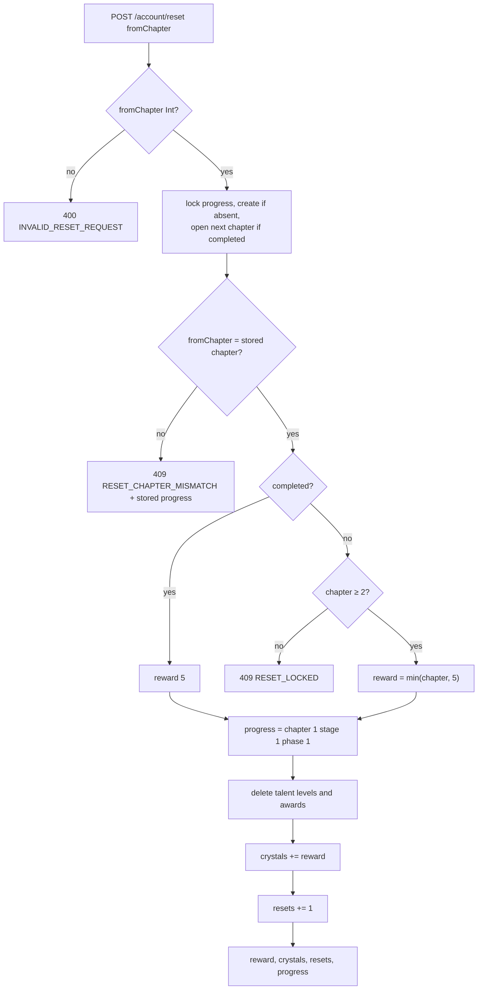

# Flowchart — account-reset

```mermaid
flowchart TD
    A[POST /account/reset fromChapter] --> B{fromChapter Int?}
    B -- no --> E1[400 INVALID_RESET_REQUEST]
    B -- yes --> C[lock progress, create if absent,<br/>open next chapter if completed]
    C --> D{fromChapter = stored chapter?}
    D -- no --> E2[409 RESET_CHAPTER_MISMATCH + stored progress]
    D -- yes --> F{completed?}
    F -- yes --> R5[reward 5]
    F -- no --> G{chapter ≥ 2?}
    G -- no --> E3[409 RESET_LOCKED]
    G -- yes --> RC["reward = min(chapter, 5)"]
    R5 --> H
    RC --> H[progress = chapter 1 stage 1 phase 1]
    H --> I[delete talent levels and awards]
    I --> J[crystals += reward]
    J --> K[resets += 1]
    K --> L[reward, crystals, resets, progress]
```

Kept: copper, equipment, hero cards and stars, leader, auto-click level, boss record.
Client: `campaignSession.restart`, `autoClick.adoptReset`, `talents.load`.
