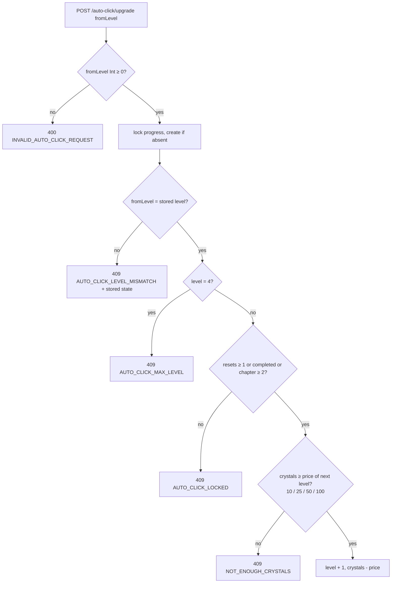
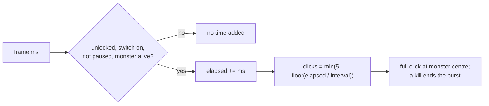

# Flowchart — auto-click

```mermaid
flowchart TD
    A[POST /auto-click/upgrade fromLevel] --> B{fromLevel Int ≥ 0?}
    B -- no --> E1[400 INVALID_AUTO_CLICK_REQUEST]
    B -- yes --> C[lock progress, create if absent]
    C --> D{fromLevel = stored level?}
    D -- no --> E2[409 AUTO_CLICK_LEVEL_MISMATCH + stored state]
    D -- yes --> F{level = 4?}
    F -- yes --> E3[409 AUTO_CLICK_MAX_LEVEL]
    F -- no --> G{resets ≥ 1 or completed or chapter ≥ 2?}
    G -- no --> E4[409 AUTO_CLICK_LOCKED]
    G -- yes --> H{crystals ≥ price of next level?<br/>10 / 25 / 50 / 100}
    H -- no --> E5[409 NOT_ENOUGH_CRYSTALS]
    H -- yes --> I[level + 1, crystals - price]
```

## Client loop

```mermaid
flowchart LR
    F[frame ms] --> C{unlocked, switch on,<br/>not paused, monster alive?}
    C -- no --> X[no time added]
    C -- yes --> A[elapsed += ms]
    A --> N["clicks = min(5, floor(elapsed / interval))"]
    N --> H[full click at monster centre;<br/>a kill ends the burst]
```
