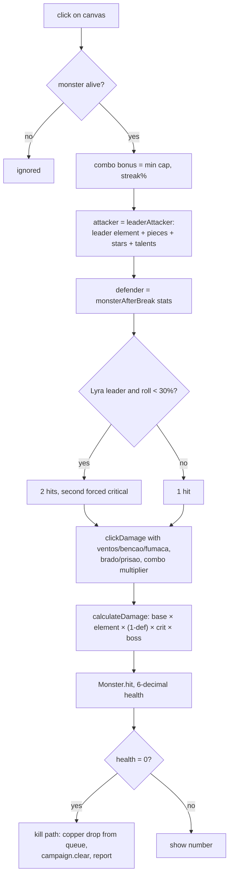
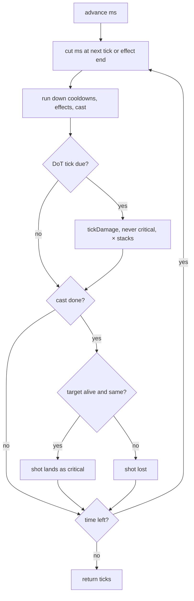

# Flowchart — combat (client only)

## One click

```mermaid
flowchart TD
    A[click on canvas] --> B{monster alive?}
    B -- no --> Z[ignored]
    B -- yes --> C[combo bonus = min cap, streak%]
    C --> D[attacker = leaderAttacker:<br/>leader element + pieces + stars + talents]
    D --> E[defender = monsterAfterBreak stats]
    E --> F{Lyra leader and roll &lt; 30%?}
    F -- yes --> G[2 hits, second forced critical]
    F -- no --> H[1 hit]
    G --> I[clickDamage with ventos/bencao/fumaca,<br/>brado/prisao, combo multiplier]
    H --> I
    I --> J["calculateDamage: base × element × (1-def) × crit × boss"]
    J --> K[Monster.hit, 6-decimal health]
    K --> L{health = 0?}
    L -- yes --> M[kill path: copper drop from queue,<br/>campaign.clear, report]
    L -- no --> N[show number]
```

## `SkillCombat.advance(ms)`

```mermaid
flowchart TD
    A[advance ms] --> B[cut ms at next tick or effect end]
    B --> C[run down cooldowns, effects, cast]
    C --> D{DoT tick due?}
    D -- yes --> E[tickDamage, never critical, × stacks]
    D -- no --> F
    E --> F{cast done?}
    F -- yes --> G{target alive and same?}
    G -- yes --> H[shot lands as critical]
    G -- no --> I[shot lost]
    F -- no --> J
    H --> J{time left?}
    I --> J
    J -- yes --> B
    J -- no --> K[return ticks]
```
