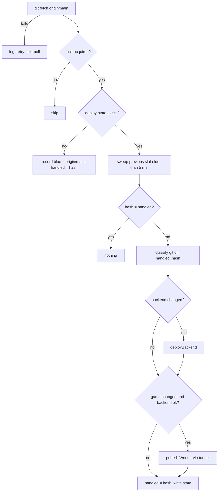
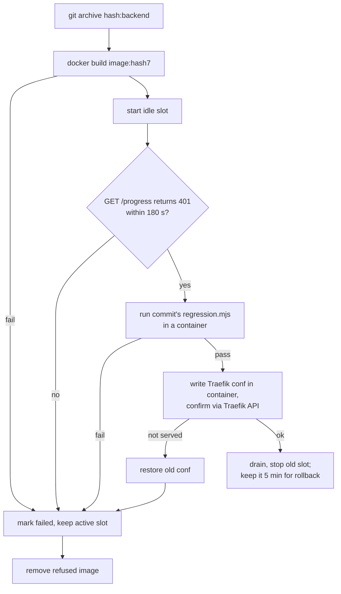

# Flowchart — deploy

## Watcher tick (every 60 s)

```mermaid
flowchart TD
    A[git fetch origin/main] -- fails --> Z[log, retry next poll]
    A --> B{lock acquired?}
    B -- no --> Z2[skip]
    B -- yes --> C{.deploy-state exists?}
    C -- no --> C1[record blue = origin/main, handled = hash]
    C -- yes --> D[sweep previous slot older than 5 min]
    D --> E{hash = handled?}
    E -- yes --> Z3[nothing]
    E -- no --> F[classify git diff handled..hash]
    F --> G{backend changed?}
    G -- yes --> H[deployBackend]
    G -- no --> I
    H --> I{game changed and backend ok?}
    I -- yes --> J[publish Worker via tunnel]
    I -- no --> K
    J --> K[handled = hash, write state]
```

## Blue-green backend deploy

```mermaid
flowchart TD
    A[git archive hash:backend] --> B[docker build image:hash7]
    B -- fail --> X[mark failed, keep active slot]
    B --> C[start idle slot]
    C --> D{GET /progress returns 401<br/>within 180 s?}
    D -- no --> X
    D -- yes --> E[run commit's regression.mjs<br/>in a container]
    E -- fail --> X
    E -- pass --> F[write Traefik conf in container,<br/>confirm via Traefik API]
    F -- not served --> F2[restore old conf] --> X
    F -- ok --> G[drain, stop old slot;<br/>keep it 5 min for rollback]
    X --> R[remove refused image]
```
