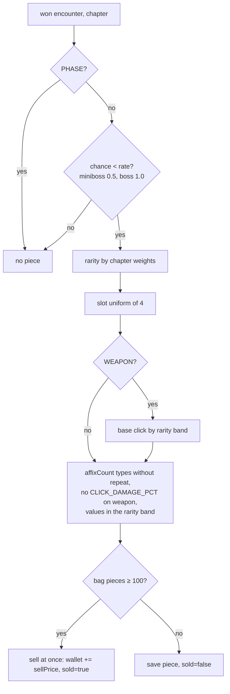
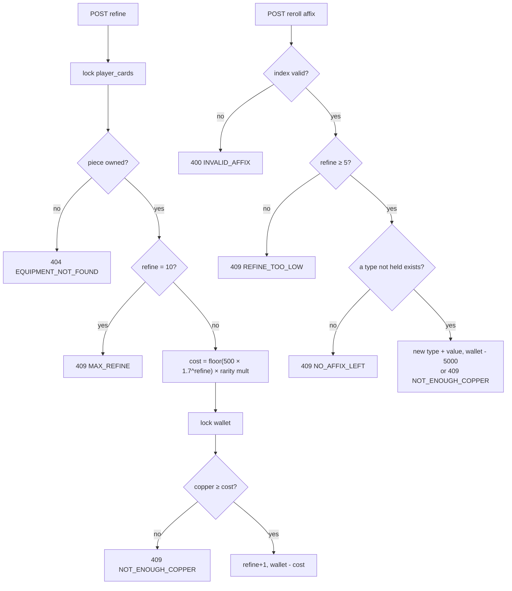

# Flowchart — equipment

## Drop of a won boss (`EquipmentRewards.award`, under the player lock)

```mermaid
flowchart TD
    A[won encounter, chapter] --> B{PHASE?}
    B -- yes --> N[no piece]
    B -- no --> C{chance &lt; rate?<br/>miniboss 0.5, boss 1.0}
    C -- no --> N
    C -- yes --> D[rarity by chapter weights]
    D --> E[slot uniform of 4]
    E --> F{WEAPON?}
    F -- yes --> G[base click by rarity band]
    F -- no --> H
    G --> H[affixCount types without repeat,<br/>no CLICK_DAMAGE_PCT on weapon,<br/>values in the rarity band]
    H --> I{bag pieces ≥ 100?}
    I -- yes --> J[sell at once: wallet += sellPrice, sold=true]
    I -- no --> K[save piece, sold=false]
```

## Refine and reroll

```mermaid
flowchart TD
    R[POST refine] --> R1[lock player_cards]
    R1 --> R2{piece owned?}
    R2 -- no --> E404[404 EQUIPMENT_NOT_FOUND]
    R2 -- yes --> R3{refine = 10?}
    R3 -- yes --> E1[409 MAX_REFINE]
    R3 -- no --> R4["cost = floor(500 × 1.7^refine) × rarity mult"]
    R4 --> R5[lock wallet]
    R5 --> R6{copper ≥ cost?}
    R6 -- no --> E2[409 NOT_ENOUGH_COPPER]
    R6 -- yes --> R7[refine+1, wallet - cost]
    X[POST reroll affix] --> X1{index valid?}
    X1 -- no --> E3[400 INVALID_AFFIX]
    X1 -- yes --> X2{refine ≥ 5?}
    X2 -- no --> E4[409 REFINE_TOO_LOW]
    X2 -- yes --> X3{a type not held exists?}
    X3 -- no --> E5[409 NO_AFFIX_LEFT]
    X3 -- yes --> X4[new type + value, wallet - 5000<br/>or 409 NOT_ENOUGH_COPPER]
```
