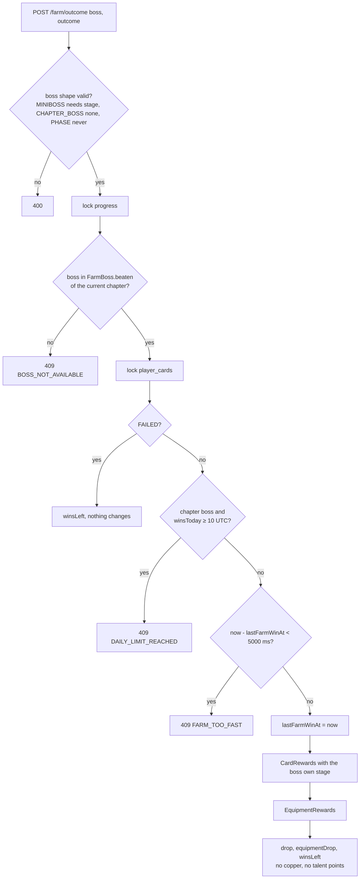

# Flowchart — farm

```mermaid
flowchart TD
    A[POST /farm/outcome boss, outcome] --> B{boss shape valid?<br/>MINIBOSS needs stage, CHAPTER_BOSS none, PHASE never}
    B -- no --> E1[400]
    B -- yes --> C[lock progress]
    C --> D{boss in FarmBoss.beaten<br/>of the current chapter?}
    D -- no --> E2[409 BOSS_NOT_AVAILABLE]
    D -- yes --> L[lock player_cards]
    L --> F{FAILED?}
    F -- yes --> R1[winsLeft, nothing changes]
    F -- no --> G{chapter boss and<br/>winsToday ≥ 10 UTC?}
    G -- yes --> E3[409 DAILY_LIMIT_REACHED]
    G -- no --> H{now - lastFarmWinAt &lt; 5000 ms?}
    H -- yes --> E4[409 FARM_TOO_FAST]
    H -- no --> I[lastFarmWinAt = now]
    I --> J[CardRewards with the boss own stage]
    J --> K[EquipmentRewards]
    K --> R2[drop, equipmentDrop, winsLeft<br/>no copper, no talent points]
```
