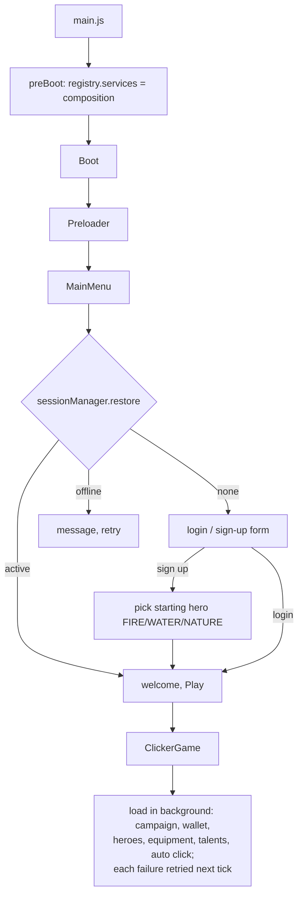
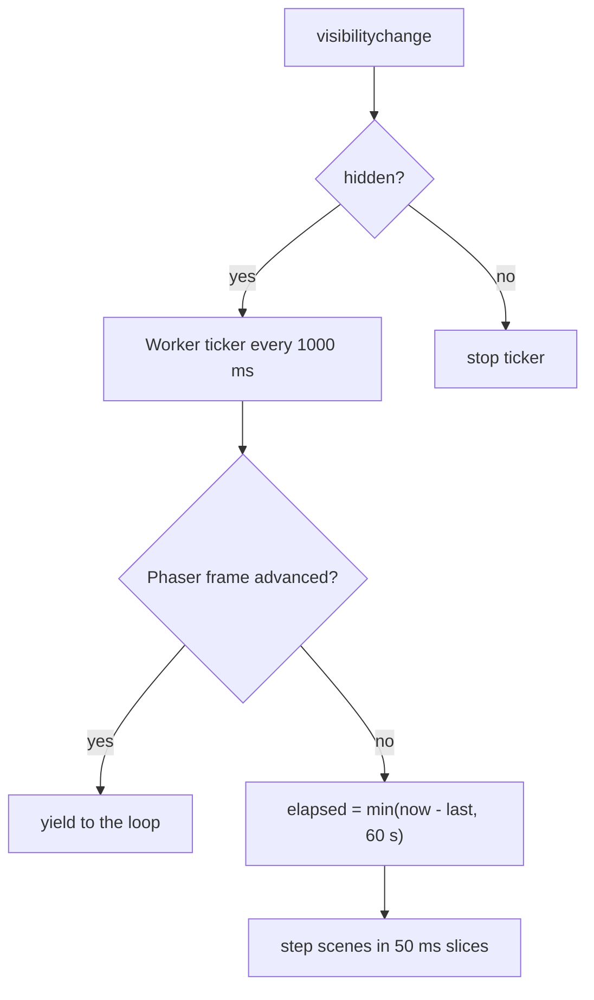

# Flowchart — game-shell

## Boot

```mermaid
flowchart TD
    M[main.js] --> P[preBoot: registry.services = composition]
    P --> B[Boot] --> PL[Preloader] --> MM[MainMenu]
    MM --> R{sessionManager.restore}
    R -- active --> W[welcome, Play]
    R -- none --> F[login / sign-up form]
    R -- offline --> O[message, retry]
    F -- sign up --> E[pick starting hero FIRE/WATER/NATURE] --> W
    F -- login --> W
    W --> CG[ClickerGame]
    CG --> L[load in background: campaign, wallet,<br/>heroes, equipment, talents, auto click;<br/>each failure retried next tick]
```

## Background fight (tab hidden)

```mermaid
flowchart TD
    V[visibilitychange] --> H{hidden?}
    H -- yes --> T[Worker ticker every 1000 ms]
    H -- no --> S[stop ticker]
    T --> K{Phaser frame advanced?}
    K -- yes --> Y[yield to the loop]
    K -- no --> G["elapsed = min(now - last, 60 s)"]
    G --> ST[step scenes in 50 ms slices]
```
