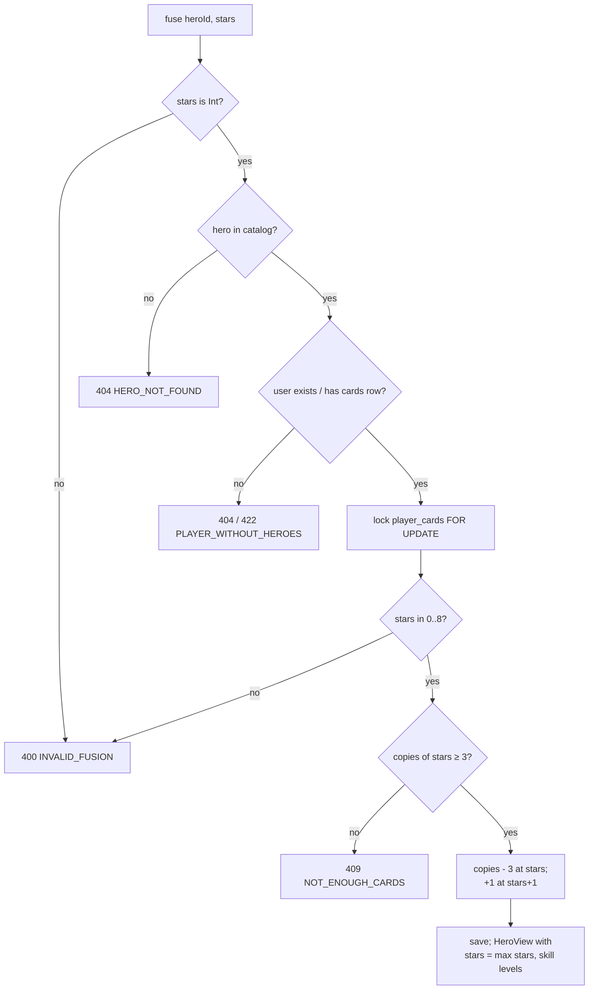
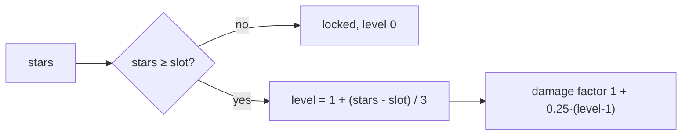

# Flowchart — heroes

## Fusion (`POST /heroes/{id}/fuse`)

```mermaid
flowchart TD
    A[fuse heroId, stars] --> B{stars is Int?}
    B -- no --> E1[400 INVALID_FUSION]
    B -- yes --> C{hero in catalog?}
    C -- no --> E2[404 HERO_NOT_FOUND]
    C -- yes --> D{user exists / has cards row?}
    D -- no --> E3[404 / 422 PLAYER_WITHOUT_HEROES]
    D -- yes --> L[lock player_cards FOR UPDATE]
    L --> F{stars in 0..8?}
    F -- no --> E1
    F -- yes --> G{copies of stars ≥ 3?}
    G -- no --> E4[409 NOT_ENOUGH_CARDS]
    G -- yes --> H[copies - 3 at stars;<br/>+1 at stars+1]
    H --> I[save; HeroView with<br/>stars = max stars, skill levels]
```

## Skill unlock and level

```mermaid
flowchart LR
    S[stars] --> U{stars ≥ slot?}
    U -- no --> L0[locked, level 0]
    U -- yes --> LV["level = 1 + (stars - slot) / 3"]
    LV --> F["damage factor 1 + 0.25·(level-1)"]
```
