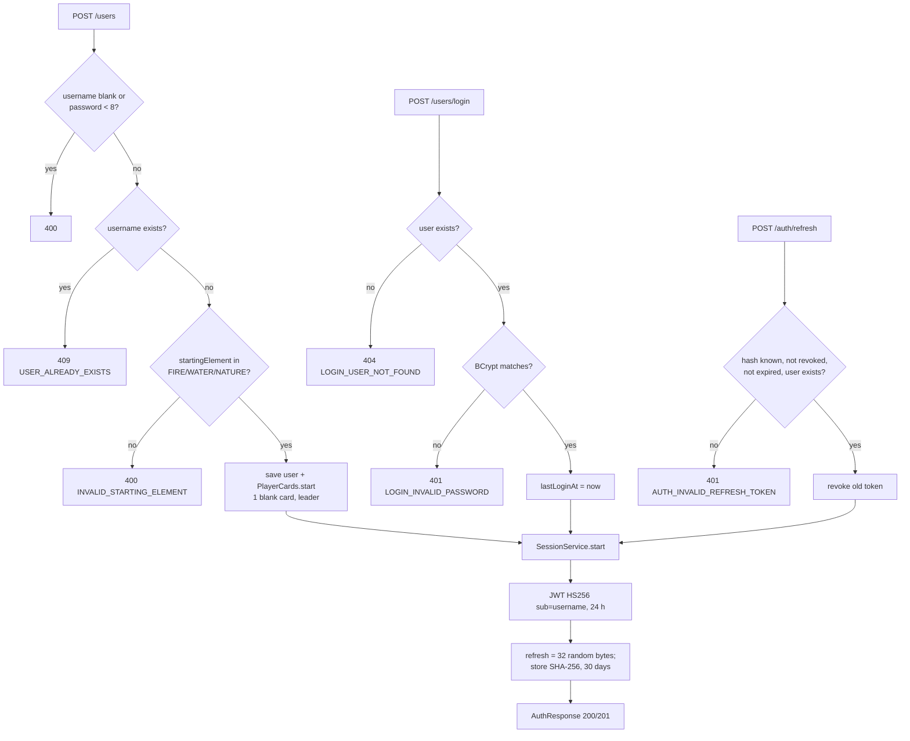
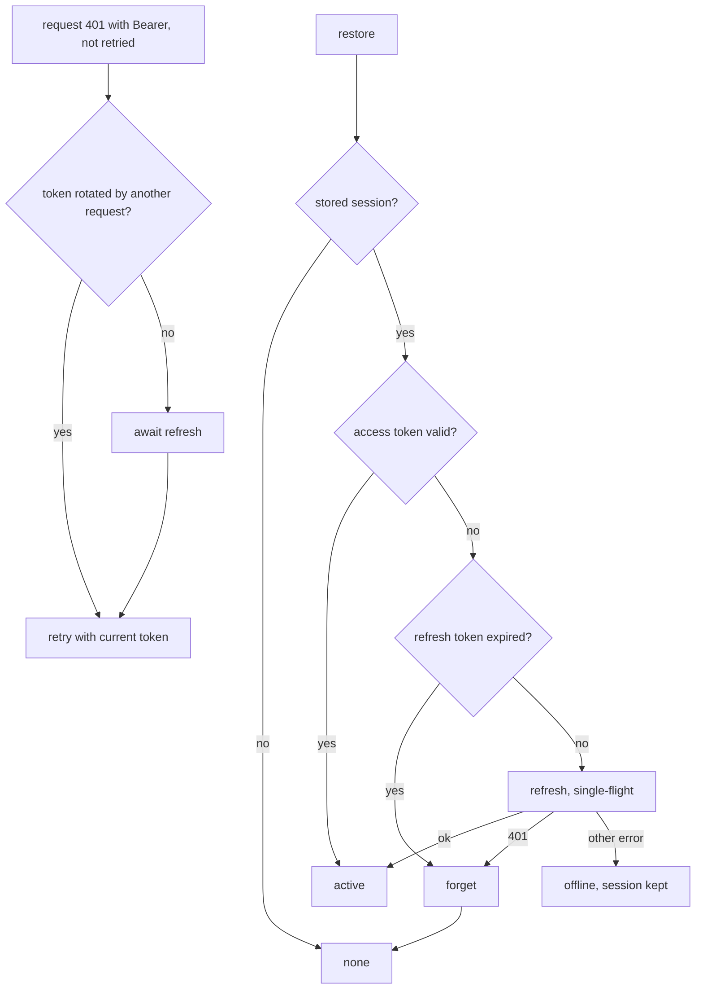

# Flowchart — session

## Sign-up, login and refresh (backend)

```mermaid
flowchart TD
    A[POST /users] --> B{username blank or<br/>password &lt; 8?}
    B -- yes --> E400[400]
    B -- no --> C{username exists?}
    C -- yes --> E409[409 USER_ALREADY_EXISTS]
    C -- no --> D{startingElement in<br/>FIRE/WATER/NATURE?}
    D -- no --> E400b[400 INVALID_STARTING_ELEMENT]
    D -- yes --> F[save user + PlayerCards.start<br/>1 blank card, leader]
    F --> S[SessionService.start]
    L[POST /users/login] --> L1{user exists?}
    L1 -- no --> E404[404 LOGIN_USER_NOT_FOUND]
    L1 -- yes --> L2{BCrypt matches?}
    L2 -- no --> E401[401 LOGIN_INVALID_PASSWORD]
    L2 -- yes --> L3[lastLoginAt = now] --> S
    S --> S1[JWT HS256 sub=username, 24 h]
    S1 --> S2[refresh = 32 random bytes;<br/>store SHA-256, 30 days]
    S2 --> R[AuthResponse 200/201]
    X[POST /auth/refresh] --> X1{hash known, not revoked,<br/>not expired, user exists?}
    X1 -- no --> E401b[401 AUTH_INVALID_REFRESH_TOKEN]
    X1 -- yes --> X2[revoke old token] --> S
```

## Client restore and retry

```mermaid
flowchart TD
    A[restore] --> B{stored session?}
    B -- no --> N[none]
    B -- yes --> C{access token valid?}
    C -- yes --> ACT[active]
    C -- no --> D{refresh token expired?}
    D -- yes --> F[forget] --> N
    D -- no --> G[refresh, single-flight]
    G -- ok --> ACT
    G -- 401 --> F
    G -- other error --> OFF[offline, session kept]
    H[request 401 with Bearer, not retried] --> I{token rotated by another request?}
    I -- yes --> J[retry with current token]
    I -- no --> K[await refresh] --> J
```
