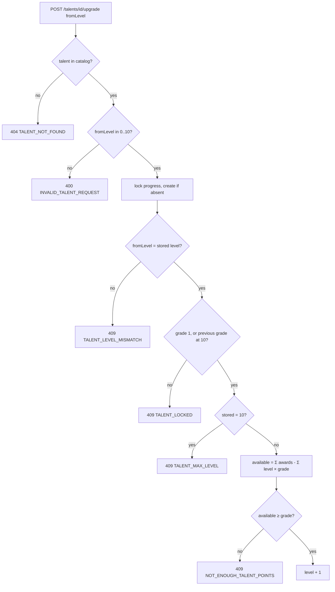

# Flowchart — talents

```mermaid
flowchart TD
    A[POST /talents/id/upgrade fromLevel] --> B{talent in catalog?}
    B -- no --> E1[404 TALENT_NOT_FOUND]
    B -- yes --> C{fromLevel in 0..10?}
    C -- no --> E2[400 INVALID_TALENT_REQUEST]
    C -- yes --> D[lock progress, create if absent]
    D --> F{fromLevel = stored level?}
    F -- no --> E3[409 TALENT_LEVEL_MISMATCH]
    F -- yes --> G{grade 1, or previous grade at 10?}
    G -- no --> E4[409 TALENT_LOCKED]
    G -- yes --> H{stored = 10?}
    H -- yes --> E5[409 TALENT_MAX_LEVEL]
    H -- no --> I["available = Σ awards - Σ level × grade"]
    I --> J{available ≥ grade?}
    J -- no --> E6[409 NOT_ENOUGH_TALENT_POINTS]
    J -- yes --> K[level + 1]
```

Points are earned in `ProgressService` on the first CLEARED of each position key (miniboss 2, chapter boss 5, phase 0).
