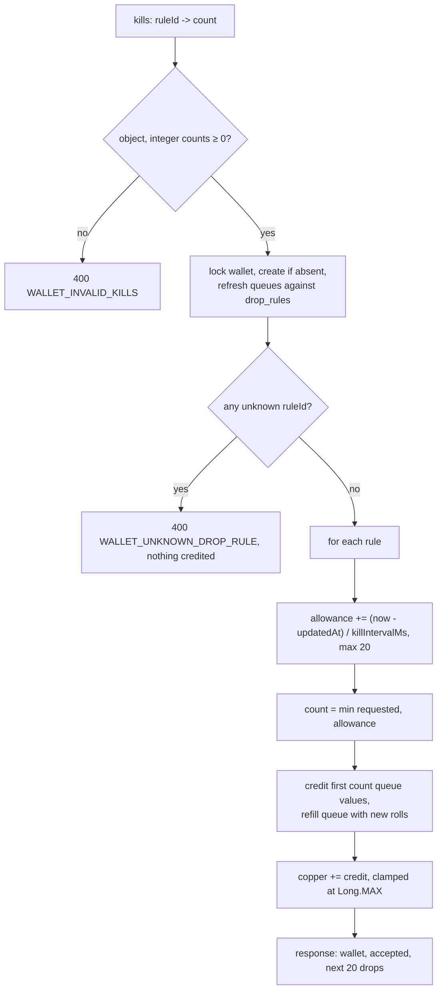
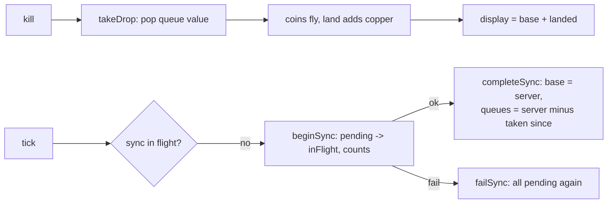

# Flowchart — wallet

## `POST /wallet/sync`

```mermaid
flowchart TD
    A[kills: ruleId -> count] --> B{object, integer counts ≥ 0?}
    B -- no --> E1[400 WALLET_INVALID_KILLS]
    B -- yes --> C[lock wallet, create if absent,<br/>refresh queues against drop_rules]
    C --> D{any unknown ruleId?}
    D -- yes --> E2[400 WALLET_UNKNOWN_DROP_RULE, nothing credited]
    D -- no --> F[for each rule]
    F --> G["allowance += (now - updatedAt) / killIntervalMs, max 20"]
    G --> H[count = min requested, allowance]
    H --> I[credit first count queue values,<br/>refill queue with new rolls]
    I --> J[copper += credit, clamped at Long.MAX]
    J --> K[response: wallet, accepted, next 20 drops]
```

## Client ledger

```mermaid
flowchart LR
    K[kill] --> T[takeDrop: pop queue value]
    T --> L[coins fly, land adds copper]
    L --> D[display = base + landed]
    S[tick] --> B{sync in flight?}
    B -- no --> BS[beginSync: pending -> inFlight, counts]
    BS -- ok --> CS[completeSync: base = server,<br/>queues = server minus taken since]
    BS -- fail --> FS[failSync: all pending again]
```
